# CompassChat - Chat with Your Code

A complete full-stack application that enables intelligent conversations with your codebase using advanced Graph Retrieval-Augmented Generation (GraphRAG) and Large Language Models.

## 🚀 Features

### Core Capabilities
- **GitHub Repository Analysis**: Clone and analyze any GitHub repository
- **Hybrid GraphRAG**: Advanced retrieval combining vector similarity, full-text search, and graph traversal
- **Real-time Chat**: WebSocket-based streaming chat interface
- **Code Understanding**: Deep AST parsing for functions, classes, and relationships
- **Multi-language Support**: Python, JavaScript, TypeScript, Java, C++

### Technical Architecture
- **Backend**: FastAPI with Neo4j Graph Database
- **Frontend**: React TypeScript with Vite
- **AI**: OpenAI GPT-4o-mini for chat and embeddings
- **Graph Database**: Neo4j with vector and full-text indexing
- **Code Analysis**: Tree-sitter for precise AST parsing

## 📋 Prerequisites

- Node.js 18+
- Python 3.8+
- Docker and Docker Compose
- OpenAI API key

## 🛠️ Installation

### 1. Clone the Repository
```bash
git clone <repository-url>
cd CompassChat
```

### 2. Environment Setup

Create `.env` files in both backend and frontend directories:

**Backend (.env)**:
```env
NEO4J_URI=bolt://localhost:7687
NEO4J_USER=neo4j
NEO4J_PASSWORD=compasschat
OPENAI_API_KEY=your_openai_api_key_here
```

**Frontend (.env)**:
```env
VITE_API_URL=http://localhost:8000
```

### 3. Start Services

```bash
# Start Neo4j database
docker-compose up -d

# Install and start backend
cd backend
pip install -r requirements.txt
uvicorn main:app --reload --host 0.0.0.0 --port 8000

# Install and start frontend (in new terminal)
cd frontend
npm install
npm run dev
```

## 🏗️ Architecture Overview

### Backend Services

#### Graph Service (`services/graph_service.py`)
- **GraphRAGRetriever**: Implements hybrid retrieval using Neo4j GraphRAG
- **Official GraphRAG Integration**: Uses `neo4j-graphrag` library with fallback
- **Custom Hybrid Search**: Vector + full-text + graph traversal
- **Smart Indexing**: Automatic vector and full-text index creation

#### Key Components:
```python
# Neo4j GraphRAG Integration
from neo4j_graphrag.retrievers import HybridCypherRetriever
from neo4j_graphrag.generation import GraphRAG, RagTemplate
from neo4j_graphrag.llm import OpenAILLM

# Hybrid retrieval with custom Cypher
retriever = HybridCypherRetriever(
    driver=driver,
    vector_index_name="chunk_embeddings",
    fulltext_index_name="chunk_content",
    retrieval_query=custom_retrieval_query,
    embedder=embedder
)
```

## 🎯 Technical & Product Decision Documentation

### Core Architecture Decisions

#### 1. **Graph Database Choice: Neo4j**
**Decision**: Use Neo4j as the primary database for code representation and retrieval.

- Official Neo4j GraphRAG library for production-ready implementation
- Superior code understanding through relationship awareness


#### 2. **Hybrid Retrieval Strategy**
**Decision**: Combine vector similarity, full-text search, and graph traversal for optimal code retrieval.

**Technical Reasoning**:
- **Vector Similarity (60% weight)**: Captures semantic intent of natural language queries
- **Full-text Search (20% weight)**: Ensures exact keyword matches aren't missed
- **Graph Traversal (20% weight)**: Adds contextual code relationships

**Performance Optimizations**:
```python
# Early filtering to prevent irrelevant query processing
irrelevant_keywords = ['weather', 'forecast', 'cooking', 'medicine', ...]
if any(keyword in query_lower for keyword in irrelevant_keywords):
    return []  # Skip expensive Neo4j queries

# Vector score thresholds for performance
WHERE vector_score > 0.1  // Early filtering
WHERE vector_score > 0.15 // Secondary filtering
WHERE combined_score > 0.1 // Final filtering
```

**Why This Approach**:
- Prevents false negatives from pure semantic search
- Maintains relevance through graph context
- Optimizes performance by filtering irrelevant queries early

#### 3. **FastAPI Backend Framework**
**Decision**: Use FastAPI as the web framework for the backend.

**Technical Benefits**:
- **Async Support**: Native async/await for concurrent operations
- **Automatic Documentation**: OpenAPI/Swagger generation
- **Type Safety**: Pydantic models for request/response validation
- **WebSocket Support**: Real-time streaming chat interface

#### 4. **Tree-sitter for Code Parsing**
**Decision**: Use Tree-sitter for Abstract Syntax Tree (AST) parsing across multiple languages.

**Technical Advantages**:
- **Multi-language Support**: Single API for Python, JavaScript, TypeScript, Java, C++
- **Incremental Parsing**: Fast updates for large files
- **Error Recovery**: Continues parsing despite syntax errors
- **Precise Extraction**: Accurate function/class boundaries and relationships

#### 5. **Async Processing Architecture**
**Decision**: Implement async processing for LLM operations and database queries.


#### 6. **Embedding and Caching Strategy**
**Decision**: Use OpenAI embeddings with intelligent caching.

**Implementation**:
```python
# services/embedding_cache.py
def get_cached_embedding(text: str) -> List[float]:
    # 1. Check memory cache
    # 2. Check database cache
    # 3. Generate and cache new embedding
```

**Benefits**:
- Reduced API costs through caching
- Faster retrieval for repeated content
- Consistent embeddings across sessions

#### 7. **Repository History & Context**
**Decision**: Maintain repository analysis history and provide context switching.

**Product Benefits**:
- Users can quickly switch between analyzed repositories
- No need to re-analyze frequently used repositories
- Clear indication of what repositories are available

**Technical Storage**:
```python
# SQLite for user sessions and repository metadata
class Repository(Base):
    id = Column(Integer, primary_key=True)
    name = Column(String(255), nullable=False)
    owner = Column(String(255), nullable=False)
    url = Column(String(500), nullable=False)
    analyzed_at = Column(DateTime, default=datetime.utcnow)
    user_id = Column(Integer, ForeignKey('users.id'))
```


#### 8. **Context Window Management**
**Decision**: Implement intelligent context truncation and summarization.

**Technical Strategy**:
```python
def build_context_from_results(search_results: List[Dict]) -> str:
    # Prioritize: high-score chunks, unique files, diverse chunk types
    # Truncate: long code blocks, preserve structure
    # Format: clear separators, metadata headers
```

**Benefits**:
- Maximum relevant information within token limits
- Consistent response quality regardless of codebase size
- Cost optimization through efficient token usage


---

These decisions collectively create a robust, scalable, and user-friendly code analysis platform that balances performance, cost, and functionality while maintaining strong technical foundations for future growth.

### Hybrid GraphRAG Implementation


Repository Data Storage


  
Query Processing

```mermaid
graph TB
    subgraph "User Query Processing"
        UQ[User Question] --> QA[Query Analysis]
        QA --> QE[Query Embedding<br/>OpenAI text-embedding-3-small]
        QA --> QK[Extract Keywords<br/>for Full-text Search]
        QA --> RF[Repository Context<br/>Always Required]
    end
    
    subgraph "Repository-Scoped Hybrid Search"
        RF --> |owner/name| SCOPE[Search Scope Filter<br/>WHERE repo.name = $repo_name<br/>AND repo.owner = $repo_owner]
        
        QE --> VSF[Vector Search<br/>Within Repository Only]
        QK --> FTSF[Full-text Search<br/>Within Repository Only]
        
        SCOPE --> VSF
        SCOPE --> FTSF
        
        VSF --> VSR[Repository Vector Results<br/>Cosine Similarity Scores]
        FTSF --> FTSR[Repository Full-text Results<br/>Text Match Scores]
        
        subgraph "Repository Graph Traversal"
            VSR --> GT[Graph Traversal<br/>Within Repository Scope]
            FTSR --> GT
            GT --> |Find Connected| FUNC2[Related Functions<br/>in Repository]
            GT --> |Find Connected| IMP[Imported Files<br/>in Repository]
            GT --> |Find Connected| CALL[Called Functions<br/>in Repository]
            GT --> |Find Connected| CLS[Related Classes<br/>in Repository]
        end
        
        subgraph "Repository-Scoped Scoring"
            VSR --> SCORE[Combined Scoring Algorithm<br/>Repository Context Aware]
            FTSR --> SCORE
            FUNC2 --> SCORE
            IMP --> SCORE
            CALL --> SCORE
            CLS --> SCORE
            
            SCORE --> |Weight Factors| WF[• Vector Score - 0.4<br/>• Full-text Score - 0.3<br/>• Graph Connectivity - 0.2<br/>• Code Relationships - 0.1]
            WF --> RANK[Ranked Results<br/>Repository-Specific Top K]
        end
    end
    
    subgraph "Response Generation"
        RANK --> LIM[Apply Limits<br/>Backend: max_results - 10<br/>Frontend: shows all sources]
        LIM --> CTX[Build Repository Context<br/>Code + Metadata + Repo Stats]
        
        CTX --> LLM[OpenAI GPT-4o-mini<br/>Repository-Aware Response]
        LLM --> ANS[Generated Answer<br/>Repository-Specific]
        
        subgraph "Response Format"
            ANS --> RESP[Response Object]
            RANK --> SOURCES[Source Snippets<br/>All from Target Repository]
            RESP --> |answer| ANS
            RESP --> |sources| SOURCES
            SOURCES --> |file_path| FPATH[Repository File Path]
            SOURCES --> |chunk_type| CTYPE[function/class/import]
            SOURCES --> |summary| SUMM[AI Summary]
            SOURCES --> |score| SCVAL[Repository Relevance Score]
            SOURCES --> |content_preview| PREV[Repository Code Preview]
        end
    end
    
    subgraph "Frontend Display"
        RESP --> UI[Chat Interface<br/>Repository Context]
        UI --> |Shows| ANSTXT[Answer Text<br/>Repository-Focused]
        UI --> |Shows| SRCLIST[Related Code<br/>All Repository Sources]
        SRCLIST --> |Displays| SRCITEM[Source Item<br/>Repository File + Type + Score<br/>+ Summary + Code]
    end
    
    style UQ fill:#e1f5fe
    style SCOPE fill:#f3e5f5
    style VSF fill:#fff3e0
    style FTSF fill:#fff3e0
    style SCORE fill:#e8f5e8
    style LLM fill:#fce4ec
    style UI fill:#f1f8e9
```



#### 1. **Vector Similarity Search**
- **Embedding Model**: OpenAI `text-embedding-3-small`
- **Index**: Neo4j vector index on chunk embeddings
- **Scoring**: Cosine similarity between query and chunk embeddings
- **Weight**: 40% of final score

#### 2. **Full-text Search** 
- **Index**: Neo4j full-text index on chunk content
- **Features**: Keyword matching, phrase detection, stemming
- **Scoring**: TF-IDF based relevance scoring
- **Weight**: 30% of final score

#### 3. **Graph Traversal Enhancement**
- **Connected Code**: Finds functions called by relevant chunks
- **Import Analysis**: Includes imported files and dependencies  
- **Class Relationships**: Connects related methods and properties
- **File Context**: Expands search to related files
- **Weight**: 20% of final score


## 📚 API Reference

### REST Endpoints

#### Analyze Repository
```bash
POST /repos/analyze
{
  "github_url": "https://github.com/owner/repo"
}
```

#### Chat with Code
```bash
POST /chat/
{
  "question": "How does authentication work?",
  "repository": "owner/repo",
  "max_results": 10
}
```

#### Repository Statistics
```bash
GET /repos/{owner}/{name}/stats
```

### WebSocket API

#### Chat WebSocket
```bash
ws://localhost:8000/chat/ws

# Send message:
{
  "question": "Explain the main function",
  "repository": "owner/repo",
  "max_results": 10
}

# Receive responses:
{"type": "status", "message": "Searching code..."}
{"type": "answer_chunk", "content": "The main function..."}
{"type": "sources", "sources": [...]}
{"type": "complete"}
```

## 🧪 Development

### Backend Development
```bash
cd backend
pip install -r requirements.txt

# Run with auto-reload
uvicorn main:app --reload --host 0.0.0.0 --port 8000
```

### Frontend Development
```bash
cd frontend
npm install

# Development server
npm run dev

# Build for production
npm run build
```

### Docker Development
```bash
# Full stack with Docker
docker-compose up --build

# Neo4j only
docker-compose up neo4j
```

## 🚨 Troubleshooting

### Common Issues

#### Neo4j Connection Issues
```bash
# Check Neo4j status
docker-compose ps neo4j

# View Neo4j logs
docker-compose logs neo4j

# Reset database
docker-compose down -v
docker-compose up neo4j
```

#### OpenAI API Issues
- Verify API key in environment variables
- Check API quota and billing
- Monitor rate limits in logs

#### Import/Dependency Issues
```bash
# Backend dependencies
pip install -r requirements.txt

# Frontend dependencies
npm install

# Neo4j GraphRAG library
pip install neo4j-graphrag==0.1.3
```

## 🙏 Acknowledgments

- **Neo4j GraphRAG**: Official Neo4j GraphRAG Python library
- **Tree-sitter**: Multi-language parsing library
- **LlamaIndex**: Text splitting and chunking utilities
- **OpenAI**: GPT models and embeddings
- **FastAPI**: Modern Python web framework
- **React**: Frontend framework

---

Built with ❤️ for developers who want to understand their code better.
